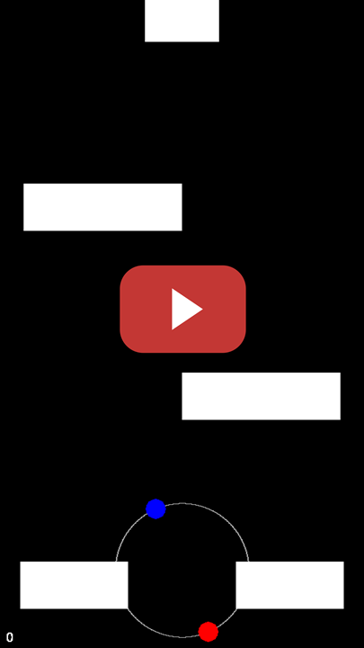

# Duet DQN - Comparing Different State Representations for Deep Q-learning

Using [keras-rl](https://github.com/keras-rl/keras-rl) to train DQN agents on [gym-duet](https://github.com/josefmal/gym-duet), an Open-AI gym implementation of the popular mobile game Duet, by Kumobius, available [here](https://www.duetgame.com/).  

<p align="center">
  <a href="https://www.youtube.com/watch?v=ozdOVRNRM-I"></a>
</p>


## Installation

The code is written for Python 3.5. To get started, first install [gym-duet](https://github.com/josefmal/gym-duet).

Then clone this repo:
```
git clone https://github.com/josefmal/duet-game-AI.git
```
And install the requirements
```
pip install -r requirements.txt
```

## Usage
Play the game manually by running:
```
python duet.py
```
Train a DQN agent on a coordinate representation of the state by using the script ```duet_coord_dqn.py```. Display its options by running:
```
python duet_coord_dqn.py -h
```

Train a DQN agent on a pixel representation of the state by using the script ```duet_pixel_dqn.py```. Display its options by running:
```
python duet_pixel_dqn.py -h
```
